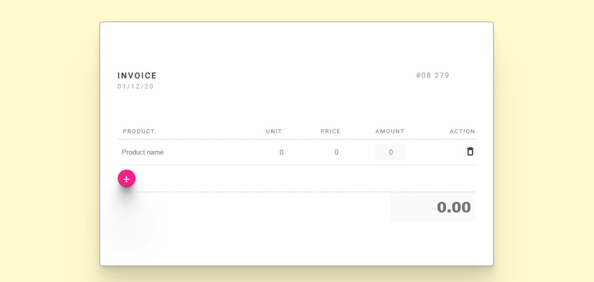

# Dynamic Invoice Generator

The **Dynamic Invoice Generator** is a web-based tool built using **HTML, CSS, and JavaScript** that allows users to easily create, edit, and download invoices in real-time. It automatically calculates totals, taxes, and discounts, making it ideal for freelancers, small businesses, and developers exploring front-end interactivity.

## 🚀 Features
- Add, edit, and delete invoice items dynamically
- Real-time total and tax calculations
- Clean, responsive UI for desktop and mobile
- Print or download the invoice as PDF

## 🛠️ Tech Stack
- HTML5
- CSS3
- JavaScript (Vanilla JS)

## 📸 Screenshot

## 📂 Project Link
[View on GitHub](https://ankitab78.github.io/Dynamic-Invoice-generator/)
